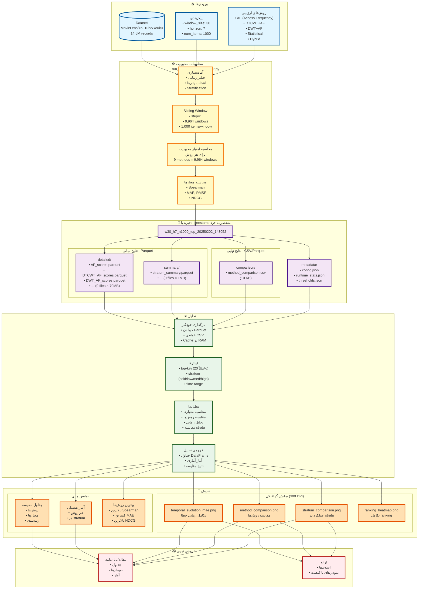
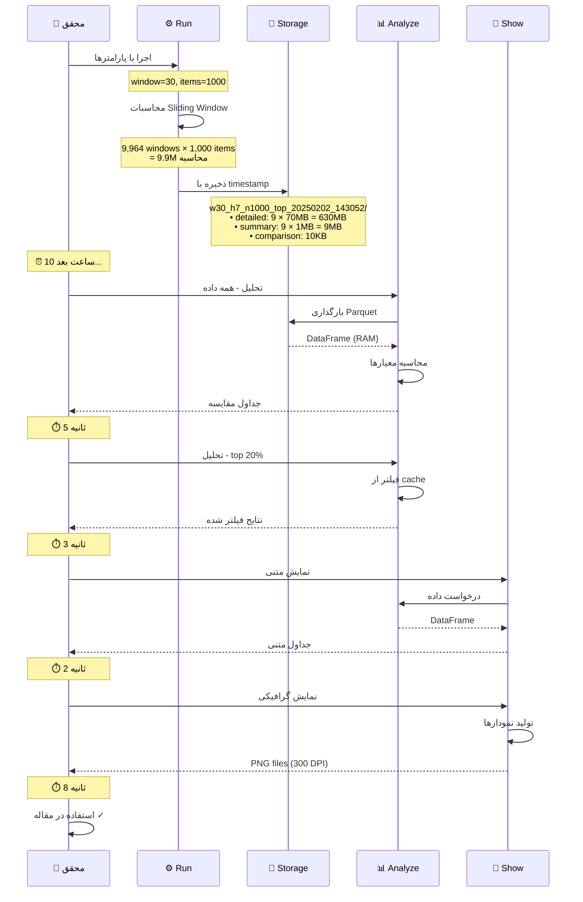
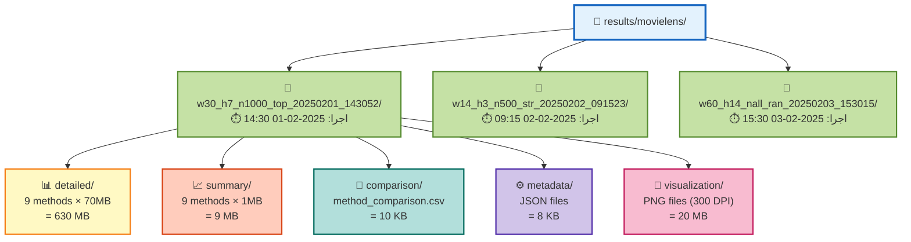
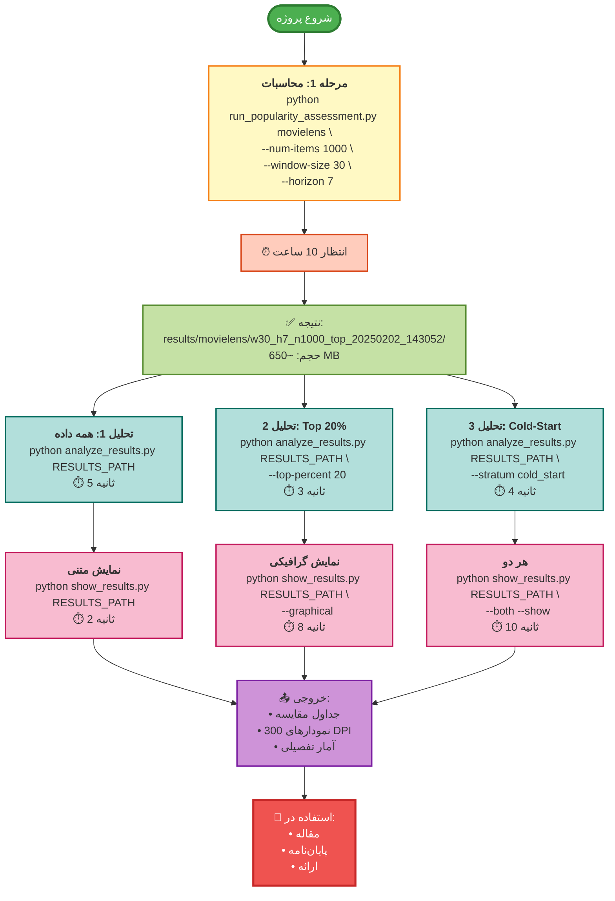

# جریان کار کامل سیستم ارزیابی محبوبیت

## 🔄 نمودار اصلی - جریان کامل



---

## 📋 نمودار ساده‌شده

```mermaid
flowchart LR
    A["📥 Dataset<br/>+ Config"] 
    B["⚙️ run_popularity_<br/>assessment.py<br/>(محاسبات)"]
    C["💾 نتایج با timestamp<br/>w30_h7_n1000_top_<br/>20250202_143052"]
    D["📊 analyze_results.py<br/>(تحلیل)"]
    E["🎨 show_results.py<br/>(نمایش)"]
    F["📤 مقاله/<br/>پایان‌نامه"]
    
    A --> B
    B --> |"حجم زیاد<br/>~630 MB"| C
    C --> |"بارگذاری<br/>سریع"| D
    D --> |"تحلیل<br/>~5 sec"| E
    E --> |"جداول<br/>نمودارها"| F
    
    style A fill:#e3f2fd,stroke:#1976d2,stroke-width:2px
    style B fill:#fff9c4,stroke:#f57f17,stroke-width:2px
    style C fill:#f3e5f5,stroke:#7b1fa2,stroke-width:2px
    style D fill:#e8f5e9,stroke:#388e3c,stroke-width:2px
    style E fill:#ffe0b2,stroke:#e64a19,stroke-width:2px
    style F fill:#ffebee,stroke:#c62828,stroke-width:2px
```



---

## 🔁 نمودار زمان‌بندی (Timeline)

```mermaid
gantt
    title جدول زمانی انجام کار
    dateFormat HH:mm
    axisFormat %H:%M
    
    section محاسبات
    run_popularity_assessment    :a1, 00:00, 10h
    
    section ذخیره
    ذخیره Parquet (630 MB)      :a2, after a1, 2m
    
    section تحلیل
    analyze - همه داده           :a3, after a2, 5s
    analyze - top 20%            :a4, after a3, 3s
    analyze - cold-start         :a5, after a4, 4s
    analyze - time range         :a6, after a5, 4s
    
    section نمایش
    show - متنی                  :a7, after a6, 2s
    show - گرافیکی               :a8, after a7, 8s
    show - تفصیلی                :a9, after a8, 3s
```



---

## 📊 نمودار جریان داده (Sequence Diagram)



---

## 📁 ساختار فایل‌ها



---

## 🔄 مثال عملی کامل



---

## 📝 خلاصه دستورات

### 1️⃣ محاسبات (یک بار - زمان‌بر)
```bash
python run_popularity_assessment.py movielens \
    --num-items 1000 \
    --window-size 30 \
    --horizon 7 \
    --format csv

# ⏱️ زمان: ~10 ساعت
# 💾 خروجی: results/movielens/w30_h7_n1000_top_20250202_143052/
# 📦 حجم: ~650 MB
```

### 2️⃣ تحلیل (بارها - سریع)
```bash
# همه داده
python analyze_results.py results/movielens/w30_h7_n1000_top_20250202_143052/

# با فیلتر
python analyze_results.py results/movielens/w30_h7_n1000_top_20250202_143052/ \
    --top-percent 20

# ⏱️ زمان هر تحلیل: ~5 ثانیه
```

### 3️⃣ نمایش (بارها - سریع)
```bash
# متنی
python show_results.py results/movielens/w30_h7_n1000_top_20250202_143052/

# گرافیکی
python show_results.py results/movielens/w30_h7_n1000_top_20250202_143052/ \
    --graphical

# هر دو
python show_results.py results/movielens/w30_h7_n1000_top_20250202_143052/ \
    --both --show

# ⏱️ زمان: ~10 ثانیه
```

---

## 📊 مقایسه زمان و کارایی

| مرحله | برنامه | دفعات اجرا | زمان/اجرا | مجموع |
|-------|---------|-----------|----------|--------|
| **1. محاسبات** | run_popularity_assessment.py | 1 بار | 10 ساعت | 10 ساعت |
| **2. ذخیره** | خودکار | 1 بار | 2 دقیقه | 2 دقیقه |
| **3. تحلیل** | analyze_results.py | N بار | 5 ثانیه | 5N ثانیه |
| **4. نمایش** | show_results.py | M بار | 10 ثانیه | 10M ثانیه |

### مثال: 10 تحلیل مختلف
- **قبل (بدون ذخیره):** 10 × 10 ساعت = **100 ساعت** ❌
- **بعد (با ذخیره):** 10 ساعت + (10 × 5 ثانیه) = **10 ساعت** ✅
- **صرفه‌جویی:** **90 ساعت (90%)** 🎯

---

## 🎯 نکات کلیدی

### ✅ نامگذاری با Timestamp
- هر اجرا نتایج منحصر به فرد دارد
- امکان مقایسه runهای مختلف
- بدون نگرانی از بازنویسی

### ✅ جداسازی مسئولیت‌ها
1. **run_popularity_assessment.py** → محاسبات (زمان‌بر)
2. **analyze_results.py** → تحلیل (سریع)
3. **show_results.py** → نمایش (سریع)

### ✅ ذخیره‌سازی هوشمند
- میانی: **Parquet** (فشرده‌سازی 85%)
- نهایی: **CSV** یا **Parquet** (قابل انتخاب)
- Metadata: **JSON** (قابل خواندن)

---

**یک بار محاسبه، بارها تحلیل و نمایش!** 🎯✨
