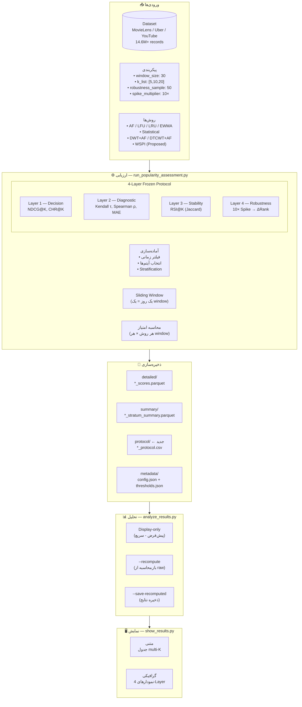
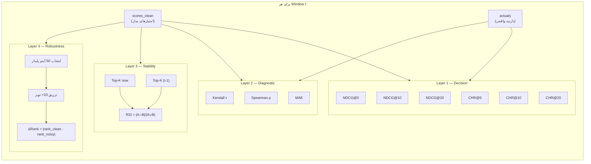
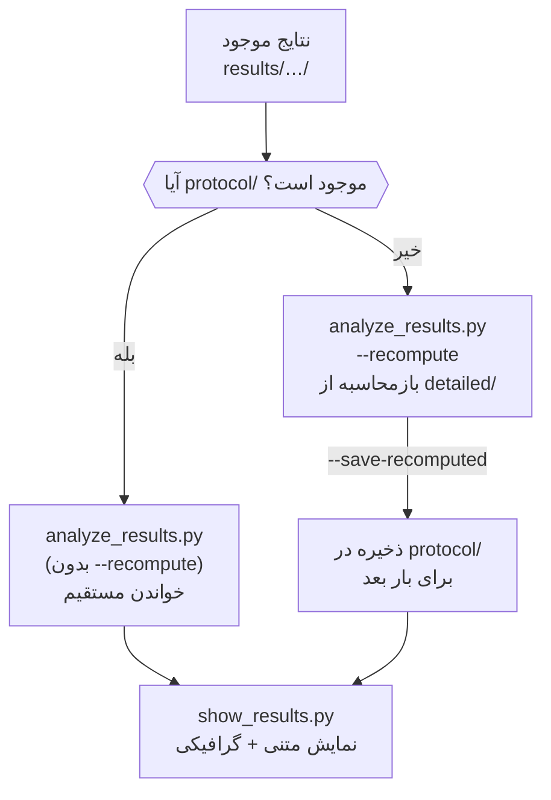

# جریان کار کامل — Frozen 4-Layer Evaluation Protocol

## 🔄 نمودار اصلی



---

## 📊 4-Layer Protocol — جزئیات



---

## 🗂️ ساختار خروجی

```
results/
└── movielens/
    └── w30_nall_top_20260214_143052/
        ├── detailed/
        │   ├── AF_scores.parquet           # امتیاز + actual + stratum per item
        │   ├── DTCWT+AF_scores.parquet
        │   ├── WSPI_scores.parquet
        │   └── ...
        ├── summary/
        │   ├── AF_stratum_summary.parquet  # میانگین per stratum per window
        │   └── ...
        ├── protocol/                       ← جدید (4-Layer)
        │   ├── AF_protocol.csv             # ndcg@K, chr@K, rsi@K, τ, ρ, ΔRank
        │   ├── DTCWT+AF_protocol.csv
        │   ├── WSPI_protocol.csv
        │   └── ...
        ├── comparison/
        │   └── method_comparison.csv
        ├── metadata/
        │   ├── config.json                 # شامل k_list, robustness_*
        │   ├── thresholds.json
        │   └── runtime_stats.json
        └── visualization/
            └── *.png
```

---

## 🔄 جریان تحلیل (دو حالت)



---

## ⚙️ مسئولیت فایل‌ها

| فایل | مسئولیت | محاسبه؟ |
|------|---------|---------|
| `run_popularity_assessment.py` | ارزیابی کامل + ذخیره 4-Layer | ✅ بله |
| `analyze_results.py` | تحلیل، فیلتر، بازمحاسبه | 🔁 اختیاری (--recompute) |
| `show_results.py` | نمایش خالص | ❌ خیر |

---

## 📋 ستون‌های protocol CSV

```
window_id, timestamp, method, num_items,
ndcg@5, ndcg@10, ndcg@20,
chr@5,  chr@10,  chr@20,
kendall_tau, spearman_rho, mae,
rsi@5,  rsi@10,  rsi@20,
robustness_distortion
```

---

## ⏱️ زمان‌بندی (۱۰۰۰ آیتم، ۱ سال)

```
run_popularity_assessment.py  →  ~10 ساعت (یک بار)
analyze_results.py (display)  →   3 ثانیه
analyze_results.py --recompute → 30 ثانیه
show_results.py               →   5 ثانیه
```
